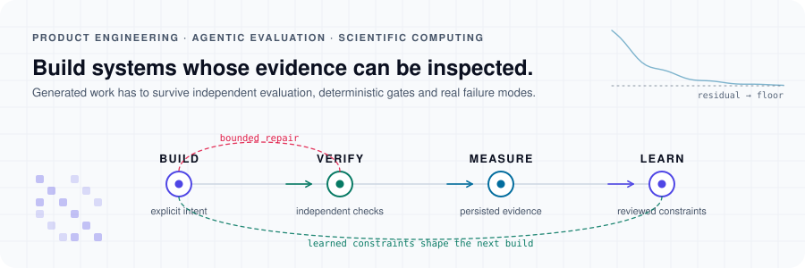
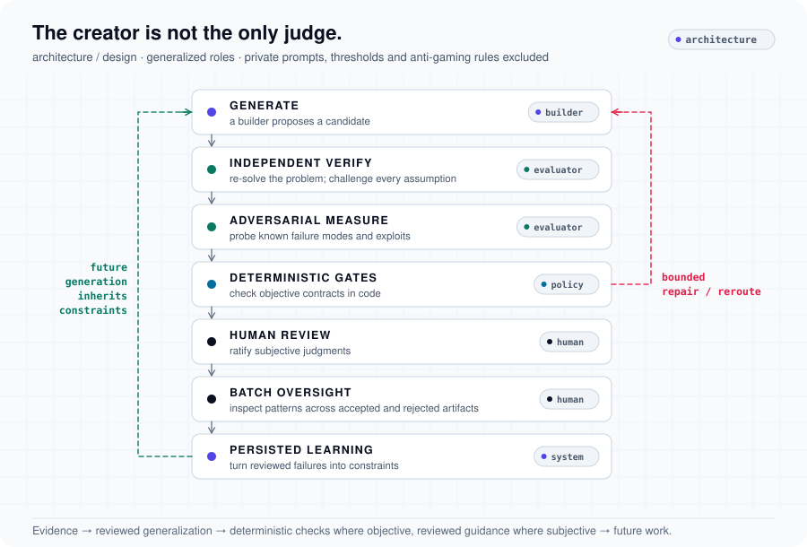
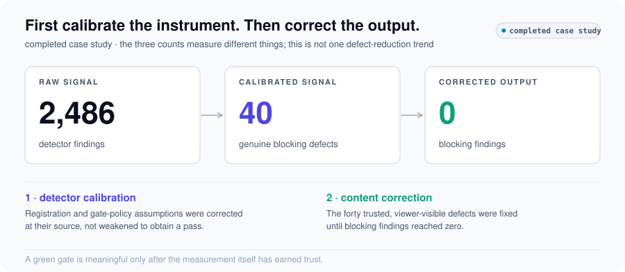

# Engineering case studies

**Build. Verify. Measure. Learn.**

Selected non-sensitive evidence from private production and agentic systems, by [Aman Panda](https://github.com/Gryffin9). Each case connects a concrete problem, an intervention and the limits of its evidence.

<picture>
  <source media="(prefers-color-scheme: dark)" srcset="assets/dark/hero.svg">
  
</picture>

## Three engineering questions

### [What should happen when nothing changed?](case-studies/production-systems.md)

A recorded local unchanged-content startup benchmark fell from **5.317 s to 155 ms**. The automated test surface expanded from **0 to 265 TypeScript / TSX test files** across unit and browser suites (February–September 2026 snapshot).

<picture>
  <source media="(prefers-color-scheme: dark)" srcset="assets/dark/production-test-growth.svg">
  
</picture>

### [Who checks the work of the agent that built it?](case-studies/agentic-reasoning.md)

Independent verification, adversarial measurement, deterministic gates and human review. The recorded passing-test series grew from **216 to 1,896** (June–September 2026 snapshot). Test count describes accumulated contracts and failure modes; it is not a quality guarantee.

<picture>
  <source media="(prefers-color-scheme: dark)" srcset="assets/dark/agentic-architecture.svg">
  
</picture>

### [Can you trust the metric before you optimize it?](case-studies/video-quality-gates.md)

**2,486 raw findings → 40 genuine blocking defects → 0 blockers.** First correct detector assumptions; then correct the real output defects. The two stages measure different things.

<picture>
  <source media="(prefers-color-scheme: dark)" srcset="assets/dark/video-gate-calibration.svg">
  
</picture>

## Inspect the evidence

- [Methodology and measurement limits](METHODOLOGY.md)
- [Public source data and definitions](data/README.md)
- [Confidentiality boundary](CONFIDENTIALITY.md)
- [Refresh and maintenance](MAINTENANCE.md)
- [Scientific computing: electrostrictive research data](https://github.com/Gryffin9/electrostrictive_metamaterial_study_data_files)

## Reproduce the public artifacts

Python 3.11 or newer; standard library only. No private repositories, credentials or external card services are required.

```bash
python3 -m unittest discover -s tests -v
python3 scripts/render_charts.py --check
python3 scripts/validate_public_release.py
python3 scripts/refresh_portfolio.py --dry-run
```

Charts are generated from committed data. Private source material is intentionally absent: readers can reproduce the visuals and arithmetic, but cannot independently rerun the private systems. **Evidence snapshot: 2026-09-10.**
