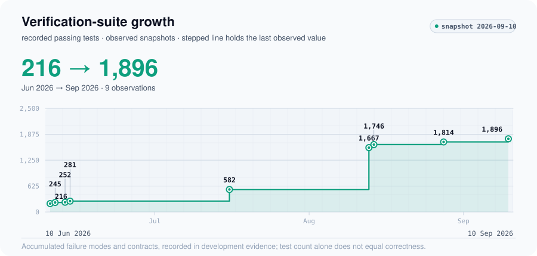

# Building an Evaluation-First Multi-Agent Reasoning Pipeline

**The system that creates an artifact should not be the only system that judges it.**

Generated work can be plausible and still fail an independent solution, violate a contract or depend on an unstated assumption. The engineering problem is to make those failures observable before acceptance.

## Separate creation from judgment

A builder proposes a candidate. Independent verification challenges its reasoning; adversarial measurement probes failure modes. Deterministic gates check objective contracts. Repair is bounded, and unresolved or subjective decisions retain human review. Batch-level oversight examines recurring patterns across accepted and rejected artifacts.

<picture>
  <source media="(prefers-color-scheme: dark)" srcset="../assets/dark/agentic-architecture.svg">
  
</picture>

This is a generalized architecture diagram, not a disclosure of private prompts, evaluator thresholds, proprietary registries or detailed anti-gaming rules. Human ratification remains part of the system.

## Turn discovered failures into repeatable checks

The recorded verification-suite series grew from **216 to 1,896 passing tests**, June 10–September 10, 2026. As failure classes were discovered, more were encoded into deterministic and regression checks instead of remaining undocumented knowledge.

<picture>
  <source media="(prefers-color-scheme: dark)" srcset="../assets/dark/agentic-verification-growth.svg">
  
</picture>

**The expanding suite represents accumulated failure modes and contracts, not a claim that test count alone equals correctness.** These are passing-test counts recorded in development evidence, not an independently rerun public benchmark or a claim that every recorded run was entirely green. The August 13 record also reports an environmental failure; skipped tests are omitted from the plot. The public repository cannot execute the private suite.

## What the learning loop means

1. Evaluation reveals a recurring failure and its evidence is persisted.
2. The failure is generalized beyond the individual artifact.
3. Objective lessons become deterministic or regression checks.
4. Subjective lessons become reviewed generation guidance.
5. Future batches encounter the updated constraints, with human acceptance retained.

This is reviewed learning from persisted failures. It is not a claim of fully autonomous self-improvement.

## What this evidence does not establish

Test growth alone does not establish solution quality, first-attempt success or evaluator independence in every run. Historical final acceptance labels can include repair history, so no direct-acceptance-rate trend is published.

[Public data](../data/README.md) · [Executable task-contract example](https://github.com/Gryffin9/agentic-engineering-template) · [All case studies](../README.md)
