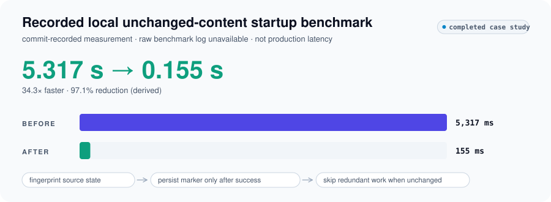
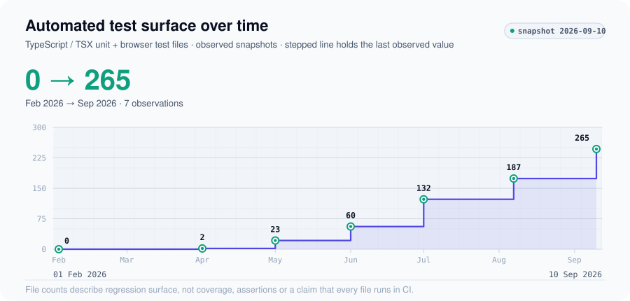

# Hardening a Production Learning Platform

This case study presents selected non-sensitive engineering evidence from a private production education system. Source code, user data, commercially sensitive metrics and private implementation details remain private.

## Make the unchanged path inexpensive

**Problem.** Startup repeated expensive content synchronization even when the source content had not changed.

**Intervention.** Fingerprint source state and persist a marker only after successful synchronization. Compare the fingerprint on later starts so unchanged input can avoid redundant synchronization work. An unsuccessful operation must not be mistaken for completed work.

**Recorded result.** The local unchanged-content startup benchmark went from **5,317 ms to 155 ms**. That is **34.3× faster**, or a **97.1% reduction**, derived from the recorded values.

<picture>
  <source media="(prefers-color-scheme: dark)" srcset="../assets/dark/production-sync-benchmark.svg">
  
</picture>

The values are persisted in a commit record; a raw committed benchmark log is unavailable. This is a recorded local run, not production request latency, a fleet-wide result or a distribution of repeated trials.

## Expand the regression surface

Automated test surface expanded across unit and browser suites: **0 → 265 tracked test files**, from February 1 to September 10, 2026.

<picture>
  <source media="(prefers-color-scheme: dark)" srcset="../assets/dark/production-test-growth.svg">
  
</picture>

The stable definition counts tracked files ending in `.test.ts`, `.test.tsx`, `.spec.ts` or `.spec.tsx` on the default branch's first-parent snapshot at the end of each date in Asia/Kolkata. Other extensions are consistently excluded. These are file counts, not test-case counts, coverage percentages or a claim that every file runs in CI.

## Engineering judgment

The optimization makes source identity and successful state explicit. The test surface makes more behavior inspectable and repeatable. Together they illustrate a useful discipline: avoid work only when the evidence says it is redundant, and preserve regression evidence as the system grows.

[Data and definitions](../data/README.md) · [Methodology](../METHODOLOGY.md) · [All case studies](../README.md)
