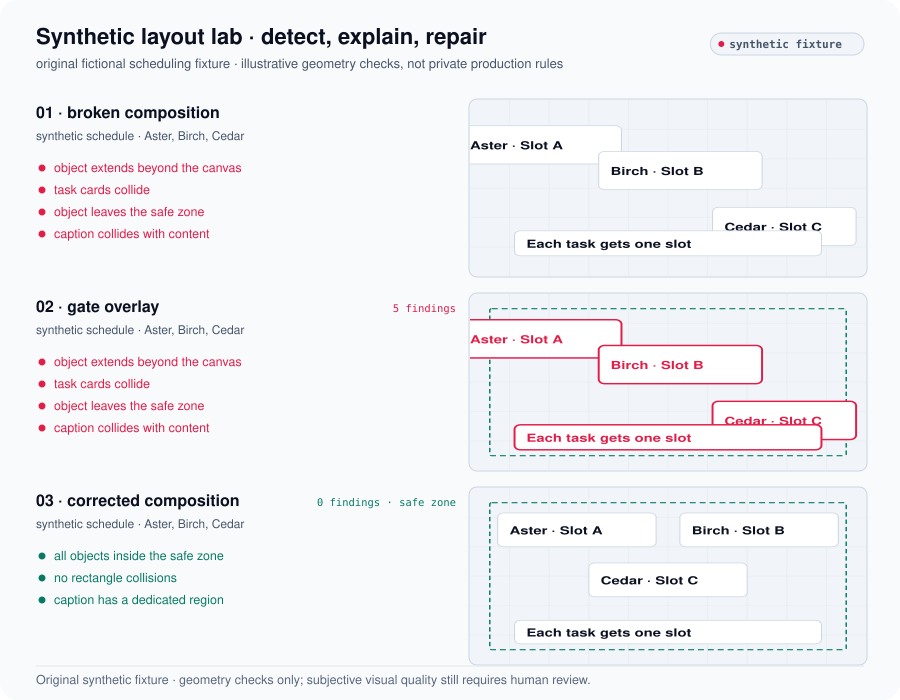

# Turning Subjective Video QA into Measurable Engineering Gates

**A green gate is useful only if the measurement deserves trust.**

The initial frame detector returned **2,486 findings**. That signal over-reported substantially: registration and gate-policy assumptions were wrong. Correcting those assumptions at their source exposed **40 genuine viewer-visible blocking defects**. Correcting the real content and layout defects then reduced blocking findings to **zero**.

<picture>
  <source media="(prefers-color-scheme: dark)" srcset="../assets/dark/video-gate-calibration.svg">
  
</picture>

## Two interventions, two meanings

| Intervention | Observation | What it establishes |
|---|---|---|
| Detector calibration | 2,486 raw findings → 40 genuine blocking defects | The detector became useful after its assumptions were corrected. |
| Content correction | 40 trusted defects → 0 blocking findings | The corrected output passed the calibrated blocking gate. |

The first stage is not a claim that thousands of real defects were fixed. The checks were corrected at the registration and gate-policy sources, rather than merely weakened to obtain a pass. Historical calibration counts are commit-recorded; the final zero-blocker state is also supported by a persisted gate artifact.

## A public, synthetic demonstration

The fictional schedule below was authored specifically for this repository. It contains no private frames, branding, source content or production detector policy. The broken composition, gate overlay and corrected composition show off-canvas objects, rectangle collisions, safe-zone framing and caption collisions.

<picture>
  <source media="(prefers-color-scheme: dark)" srcset="../assets/dark/video-synthetic-before-after.svg">
  
</picture>

The illustration uses the executable geometry in [synthetic_scene.py](../scripts/synthetic_scene.py). Public tests assert that the broken scene triggers each illustrated failure class and the corrected scene triggers none. The synthetic diagram is not a frame from the real render, and rectangle checks do not establish subjective visual quality or semantic readability.

## Delivery evidence and its boundary

The historical implementation expanded from **65 to 87 passing checks**, with **1 skipped** in the final record. Exactly **one complete real video**, approximately **14.23 minutes**, is evidenced. Its **1080p, 720p and 480p** delivery outputs were checked against persisted files and media metadata.

Final persisted state: **machine ready = true; human ratification = false**. Human premium ratification was not completed. No persisted 4K master is claimed, and this single render does not establish production throughput or repeatability across multiple videos.

The useful outcome is a trustworthy measurement process followed by actual output correction. Human viewing remains a distinct acceptance step.

[Measurement definitions](../METHODOLOGY.md) · [Public source data](../data/README.md) · [All case studies](../README.md)
